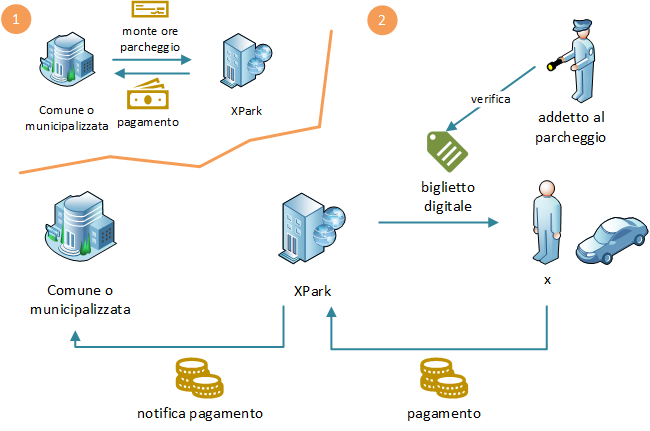

# Ticket affidabili con crittografia e blockchain

## 1. Introduzione

Ci proponiamo di risolvere un problema legato ai ticket per i parcheggi.

**Scenario**:
-	un Comune, gestisce dei parcheggi a pagamento, per i quali emette ticket e riscuote i pagamenti (in genere lo fa tramite una Municipalizzata ma nel seguito per semplicità trascureremo questo)
-	una terza parte, che chiameremo XPark (esempi reali sono EasyPark, myCicero, Telepass Pay, ecc.), ha interesse a comprare dal comune un ammontare di ore di parcheggio ed effettuare un servizio a valore aggiunto; ad es. XPark consente di pagare il parcheggio comodamente con un’App mobile senza esporre alcun biglietto all’interno dell’auto

**Problema** :

- chi assicura il Comune che XPark non abbia venduto più ore di parcheggio di quelle acquistate? attualmente XPark deve solo dichiarare a fine giornata quante transazioni economiche ha effettuato, ovviamente può ometterne una parte senza che il Comune possa accertarlo

**Nota**:
scenario (o contesto) e problema sono determinanti per la bontà della soluzione. Anche piccole differenze da quanto detto (o non detto) possono invalidare tutto il seguito.

**Criteri di progetto**

Il problema preso come riferimento è volutamente limitato per contenere la lunghezza di questo documento. Tale risulta la soluzione. Tuttavia essa rimane significativa dell’approccio al problema che qui si vuole portare avanti. 
I cardini su cui fondare una soluzione del problema sono da trovare in quegli stessi cardini che rendono funzionante la blockchain:
-	crittografia
-	teoria dei giochi

La prima rende impossibili talune azioni, la seconda rende economicamente non convenienti talaltre azioni.

## 2. Una prima soluzione

La soluzione più semplice prevede che le terze parti acquistino i ticket dei posti a pagamento solo nel momento in cui un consumatore chiede loro un ticket. Questo comporta transazioni frequenti e numerose, tuttavia esse sono tutte off-chain ossia non coinvolgono la blockchain, si svolgono su internet, quindi non sono onerose. 

1.	un consumatore chiede tramite l’app di XPark di pagare per il suo parcheggio
2.	XPark chiede al comune un ticket fornendo la targa del veicolo e il numero di ore richieste
3.	il Comune emette un biglietto firmato digitalmente (con la chiave privata del Comune); esso risulta inalterabile; deve contenere orario di emissione, orario di scadenza parcheggio, targa del veicolo
4.	il consumatore effettua il pagamento 
5.	il consumatore ottiene il suo biglietto digitale
6.	un addetto al controllo dei parcheggi, dotato come avviene oggi, di terminale, si collega ad XPark, fornisce targa del veicolo e ottiene il biglietto digitale emesso dal comune; egli controlla targa e orario e poi (qui la parte nuova) controlla la firma del biglietto

**Dettagli:**

-	i biglietti emessi sono semplici file, con qualunque formato, firmati con un algoritmo di firma digitale a chiave pubblica/privata, ad es. RSA o ECDSA o altri. Solo chi possiede la chiave privata (il comune o municipalizzata) può firmare quindi creare un biglietto valido. Al contrario tutti sono in grado di verificare la validità di un biglietto usando la chiave pubblica
-	se i biglietti vengono stampati su carta l’addetto al parcheggio non ha necessità di avere un apparecchio connesso ad internet per controllare la validità del biglietto
-	in questo documento non si prende in considerazione la parte relativa ai pagamenti (micro-pagamenti), si suppone che essa avvenga come oggi
-	i biglietti che XPark acquista da comune possono essere pagati contestualmente all’emissione oppure in blocco con la periodicità che si vuole
-	in questo scenario la blockchain non è coinvolta, non è necessaria

**Modifiche ai sistemi esistenti:**

1.	Comune/Municipalizzata devono modificare i loro sistemi per rispondere prontamente alla richiesta di ticket e per poterli emettere in real-time
2.	XPark deve modificare i propri sistemi per richiedere i ticket di volta in volta
3.	il sw di controllo dell’addetto ai parcheggi deve essere migliorato per poter controllare la firma digitale del biglietto

**Costo di emissione dei biglietti:**

-	blockchain: zero (non è coinvolta)
-	sistemi IT: possibile lieve incremento nel costo di gestione dei sistemi (le terze parti hanno già sistemi transazionali, il sistema IT del comune però probabilmente si deve adeguare)

**Come si può imbrogliare?**

-	può una terza parte omettere alcuni pagamenti? il Comune conosce in ogni momento quanti biglietti sono stati emessi e a chi sono stati consegnati quindi non è possibile nascondere delle transazioni
-	può una terza parte falsificare un biglietto? solo il Comune che possiede la chiave privata può creare biglietti validi, mentre tutti possono verificarne la validità; 
-	qualcuno può rubare la chiave privata ed emettere biglietti? la gestione della chiave privata è il punto debole del sistema; anche se non c’è motivo che essa lasci il perimetro del Comune tuttavia essa si presta a furti informatici; questa debolezza si può mitigare in vari modi: 
    -	tecnologia: usare storage protetto per le chiavi
    -	crittografia: ricorrere a tecniche di “secret splitting”, in cui la chiave privata non è detenuta da un solo funzionario bensì da N funzionari
    -	teoria dei giochi: l’addetto al controllo non si limita a controllare la firma ma collegandosi al sistema comunale verifica che il biglietto sia stato emesso e conservato nei sistemi informativi

## 3. Una soluzione più articolata

In questo paragrafo aggiungiamo un requisito al problema iniziale:
-	 l’emissione dei biglietti deve avvenire una tantum e il loro acquisto da parte delle terze parti deve avvenire in lotti

Questo requisito si generalizza nel modo seguente: 
-	non ci deve essere una comunicazione frequente tra Comune e terze parti

e lascia intendere che il Comune non vuole gestire un sistema che sia in grado di supportare un elevato numero di transazioni al secondo.

Il requisito aggiunto invalida la soluzione semplice descritta prima. I biglietti emessi a lotti non possono avere indicazione della targa e dell’orario, saranno generici (ad es. avranno un seriale, una validità temporale e un monte ore, ciascuno) e quindi si prestano ad abusi, come ad es. il loro uso ripetuto.

Per impedire questo abuso occorre che i biglietti siano “bruciati” al momento del loro uso e questa bruciatura sia a carico della terza parte (XPark). La blockchain è l’elemento naturale che garantisce le parti in gioco. 

Nota: una bruciatura comunicata non in blockchain ma al Comune funzionerebbe ugualmente bene tuttavia questa possibilità è esclusa dal requisito aggiuntivo.

La soluzione è illustrata nella figura che segue. Qui la spiegazione dei punti salienti:

I.	XPark compra i biglietti a lotti dal comune/municipalizzata; essi sono firmati

II.	XPark utilizza i biglietti acquistati per erogare ore parcheggio

    1.	il consumatore chiede un biglietto

    2.	il consumatore effettua il pagamento così come fa oggi

    3.	XPark fornisce uno dei biglietti acquistati

    4.	XPark “brucia” il biglietto, scrivendo in blockchain; per risparmiare sui costi aggrega ogni 10 minuti le bruciature in un'unica transazione su blockchain (il costo è di 0,50 euro su Ethereum, mentre è 0,00005 su un’altra blockchain pubblica, POA Network)

    5.	l’addetto al parcheggio verifica non solo il biglietto (targa, orario, ecc.) ma anche la sua bruciatura (tollerando 10 min di ritardo dall’inizio di validità del biglietto)

    6.	XPark comunica periodicamente (ad es. ogni giorno oppure ogni mese) le bruciature effettuate e il comune verifica in blockchain che siano state effettuate e che non ci siano ri-utilizzi dello stesso biglietto (questo step si può omettere, vedi come nel seguito) 

**Dettagli tecnici sul funzionamento**

-	*Come avviene la bruciatura di un elevato numero di biglietti con 1 sola transazione?* I biglietti (o meglio, il loro hash) sono organizzati in un albero binario che in crittografia si chiama Merkle Tree (si veda per es. [wikipedia](https://en.wikipedia.org/wiki/Merkle_tree)). Solo la radice di questo albero si scrive in blockchain, quindi 1 solo hash. Non c’è modo di falsificare tale root, essa è determinata univocamente da tutto l’albero. 
-	*Perché l’addetto al parcheggio deve controllare non solo il biglietto ma anche la sua bruciatura?* perché la terza parte potrebbe barare e bruciare solo una parte dei biglietti
-	*Come fa l’addetto al parcheggio a controllare la bruciatura?* si deve collegare col sistema di XPark (come fa oggi per controllare il biglietto) col suo software, sarà XPark a fornire la prova; tale prova consiste nell’indicazione del root hash su blockchain (che verrà da verificato) e gli hash necessari a ricostruire il path che dal biglietto corrente porta al root hash. La quantità di dati scambiati è limitata, pari a log2(N) dove N è il numero di biglietti bruciati nei 10 minuti: se sono 1 milione basterà scambiarsi circa 20 hash.
-	*Perché le bruciature avvengono ogni 10 minuti?* l’intervallo temporale non è scelto a caso: esso è il margine che è concesso ad un automobilista per recarsi al parcometro in un sistema tradizionale, o è il margine di ritardo concesso; nel nostro caso è il margine di ritardo delle bruciature concesso alla terza parte, tale margine serve a raggruppare le bruciature e abbassare i costi. Nulla vieta di scegliere un intervallo temporale diverso: se è più basso salgono i costi, se è superiore alla durata del parcheggio si consentono delle truffe (vedi dopo).
-	*Perché le terze parti devono fornire prova delle bruciature?* perché si potrebbe imbrogliare bruciando più volte lo stesso biglietto. Per questo nel processo è previsto il passo 6 dove XPark comunica i dettagli degli alberi (tutte le foglie) creati nella giornata o nel periodo. 
-	*Come avviene l’emissione dei biglietti?* un lotto di biglietti emessi corrisponde ad una tabella di database con una riga per biglietto, avente colonne: numero seriale, data emissione, scadenza, monte ore, numero casuale, firma. E’ sufficiente trasferire tale tabella (sotto forma di file di testo) o alcune righe di essa alla terza parte per effettuare la vendita a lotti.
-	*E’ proprio necessario il lavoro di verifica da parte del Comune (step 6)?* no, con i dovuti accorgimenti si può evitare: il lotto di biglietti venduto va organizzato in un Merkle Tree in cui le foglie riportano per ogni biglietto non solo l’hash ma anche il suo stato (vergine o bruciato). Il root hash è quello che viene scritto ogni 10 min in blockchain e copre tutto il lotto. Ogni 10 min la terza parte aggiorna l’albero con le indicazioni delle bruciature e committa il root hash. Deve però in aggiunta produrre una prova crittografica (zero knowledge proof) del suo corretto operare (ovvero che il nuovo root hash è ottenuto a partire dall’ultimo committato  con l’aggiunta dei biglietti bruciati negli ultimi 10 minuti). Tale prova può essere verificata a campione dal Comune molto facilmente oppure può essere verificata da uno smart-contract (è un’operazione costosa che è possibile su una blockchain non dispendiosa)

    

-	*Il lavoro di preparazione dei biglietti da parte del comune, per la vendita, è oneroso?* no, non lo è ma con la variante discussa al punto precedente può addirittura essere lasciato alla terza parte. Ecco come avverrebbe: XPark decide di acquistare un milione di biglietti. Li produce (sono delle righe di un database), li mette in forma di Merkle Tree e sottopone il tutto al Comune. Questi, firma i biglietti e memorizza l’albero. A questo punto XPark non può inventare alcun biglietto falso.    

**Come si può imbrogliare?**

-	*Una terza parte potrebbe non bruciare i biglietti?* no, questo comportamento verrebbe rilevato dai controlli dell’addetto al parcheggio
-	*Una terza parte potrebbe bruciare solo i biglietti per i quali ha subito il controllo?* sì, per questo è stato inserito il requisito che il biglietto deve risultare bruciato al controllo entro 10 minuti dall’orario di inizio del parcheggio
-	*Una terza parte potrebbe bruciare 2 volte lo stesso biglietto?* no, perché questo comportamento risulterebbe al comune quando la terza parte dà prova delle bruciature fatte nel periodo
-	*Può una terza parte dichiarare meno bruciature di quelle fatte?* no, perché il root hash scritto in blockchain non corrisponderebbe
-	*Può una terza parte bruciare biglietti inesistenti?* no, questo risulterebbe dalla comunicazione delle bruciature e dal controllo dell’addetto al parcheggio

**Costi**

Su blockchain:
-	*Comune*: nessuna transazione, solo letture, zero costi
-	*Addetto al parcheggio*: solo letture, zero costi
-	*XPark*: 1 transazione ogni 10 minuti = 6*24 = 144 transazioni ogni giorno (qualunque sia il numero di biglietti emessi nei dieci minuti)

Il costo delle transazioni è legato a due fattori:

-	quotazione rispetto all’euro della cripto moneta usata per pagare la transazione (“gas”)
-	livello di utilizzo della blockchain, che obbliga a pagare di più la transazione per essere preferiti (“gas price”)

Proponiamo 2 scelte diverse per la blockchain:
-	Ethereum, pregiata, molto usata, molto costosa
-	POA Network, poco usata, poco costosa

Questi i costi:

Costi                               | Ethereum | POA Network
----------------------------------- | -------- | -----------
Costo di 1 transazione              |   0,50 € |   0,00005 €
Costo giornaliero (144 transazioni) |     72 € |    0,0072 €

Entrambe sono blockchain pubbliche, visibili a tutti e danno notevoli garanzie. Ethereum dà più “lustro” alla soluzione (è più una questione di marketing che di sostanza, anche se c’è pure questa), POA Network costa 10000 volte meno perché ha un algoritmo di consenso che non brucia energia computazionale ma è basato sulla fiducia riposta in alcuni nodi validatori (Proof of Authority). Per questo e per il minore utilizzo essa cosa notevolmente meno. 

Si possono esplorare a queste URL: 
- la 1a https://etherscan.io/, 
- la 2a: https://blockscout.com/poa/core

Nota importante: il costo della transazione su Ethereum è una stima basata sugli ultimi 3 mesi, in cui quotazioni di ETH e livello di utilizzo della blockchain sono cambiati di molto, determinando un costo della specifica transazione tra 0,20 e 0,80 €. La transazione presa come riferimento effettua sullo smart-contract solo un aggiornamento di hash senza altre logiche altrimenti il costo aumenta.

Rimangono da aggiungere i costi di adeguamento dei sistemi informativi e una leggera maggiorazione del loro costo di esercizio, come illustrato nella soluzione semplice.

## 4. Impatto delle soluzioni 

La tabella che segue stima l’impatto delle 2 soluzioni sui sistemi software/IT delle parti coinvolte:

| Parte | Attività | Tipo di costo | Impatto soluzione 1 | Impatto soluzione 2 |
|-|-|-|-|-|
| Comune o  municipalizzata | Modifica software  di emissione biglietti | Una tantum | Medio   (o alto se non hanno   un sistema) | Basso |
|  | Adeguamento sistemi IT | Ricorrente | Basso | Basso |
| Terze parti (es. XPark) | Modifica software  di emissione biglietti | Una tantum | Medio | Basso  (si tratta di aggiunte) |
|  | Adeguamento sistemi IT | Ricorrente | Basso   (gli attuali sistemi  sono già pensati per   un num. elevato di tx) | Basso   (le aggiunte pesano   poco in termini  computazionali) |
| Addetto al  parcheggio | Modifica sistema di  controllo biglietti | Una tantum | Medio | Medio |
|  | Adeguamento sistemi IT | Ricorrente | Basso   (il costo di esercizio del   sistema non differisce  da quello odierno) | Basso |